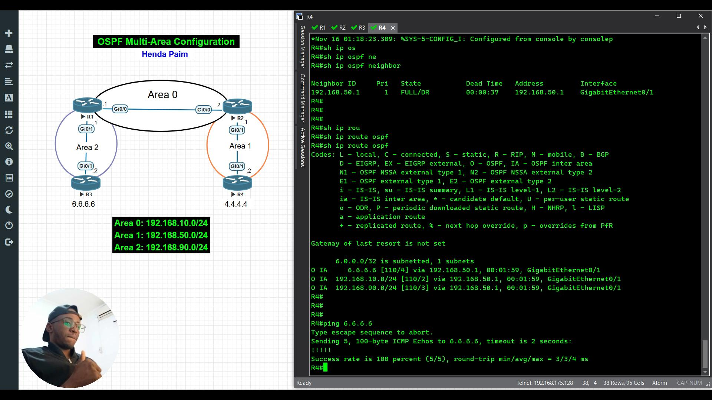
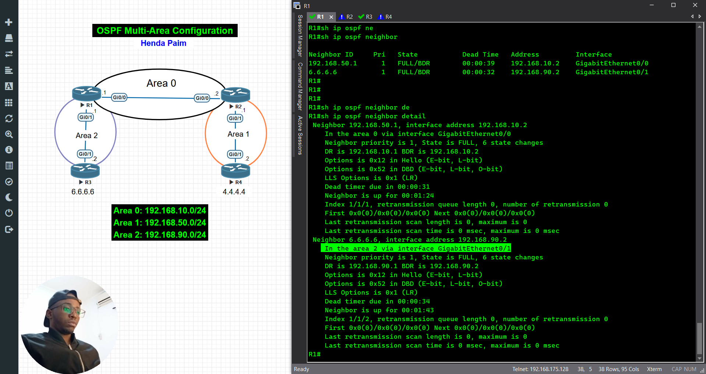
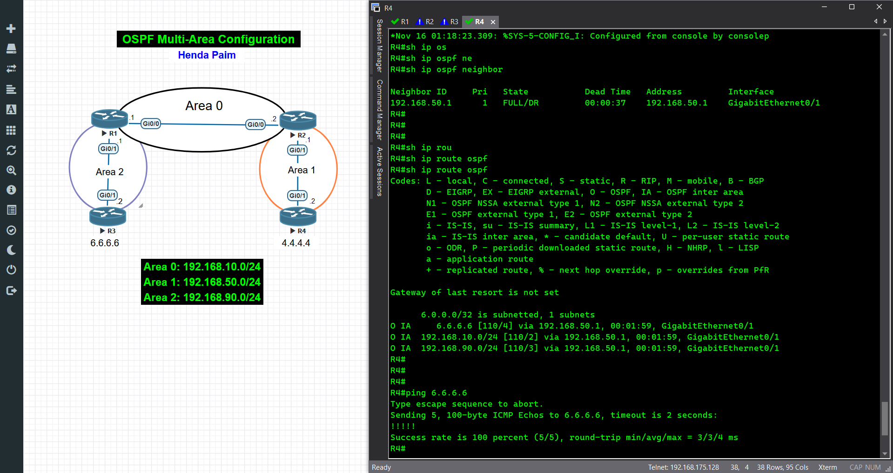
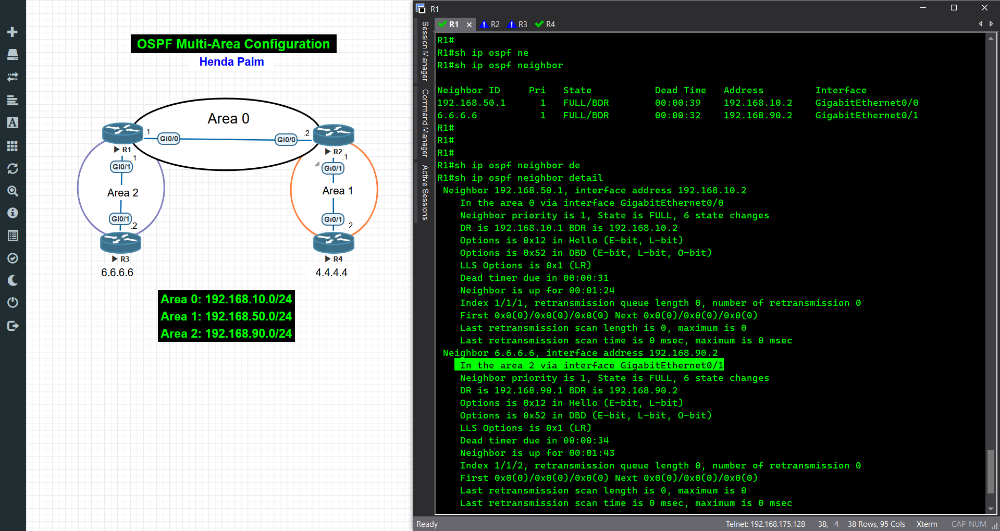
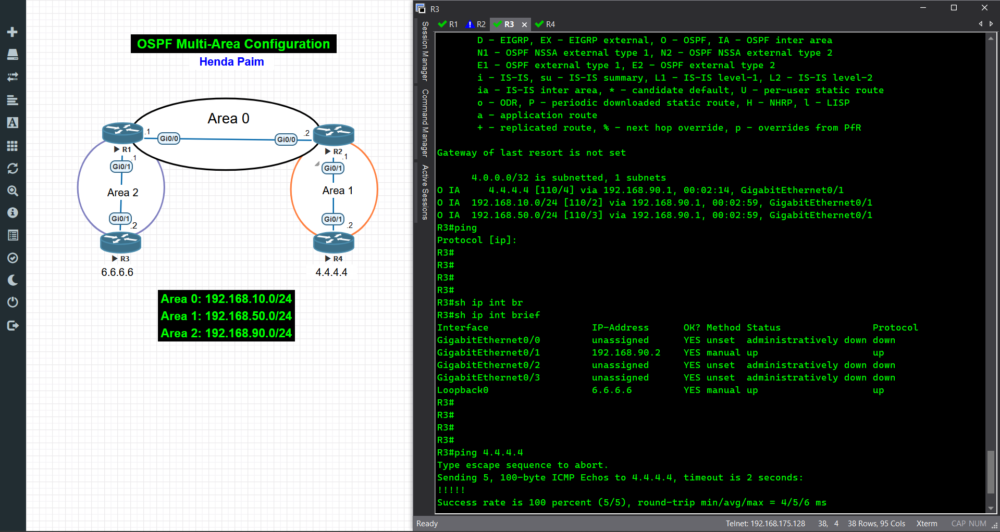

# Configuração de OSPF Multiárea no Cisco

[](https://www.youtube.com/channel/UCrEavC3tRLcR9ze7yNKqoug)
[](https://www.linkedin.com/in/hendapaim0/)



## Descrição:
Neste Lab, vamos explorar a configuração de OSPF Multiárea em roteadores Cisco utilizando o EVE-NG. Aprenda passo a passo como dividir uma rede em múltiplas áreas para melhorar a escalabilidade e o desempenho do roteamento.

📌 O que você verá neste vídeo:

- Configuração básica de OSPF em uma rede de múltiplas áreas (Área 0, Área 1 e Área 2);
- Verificação de vizinhanças OSPF e tabelas de roteamento;
- Testes de conectividade para garantir o funcionamento do roteamento inter-áreas;
- Explicação detalhada sobre como o OSPF gerencia rotas entre áreas diferentes.

💡 Sub-redes usadas neste exemplo:

- Área 0: 192.168.10.0/24
- Área 1: 192.168.50.0/24
- Área 2: 192.168.90.0/24

Se você está se preparando para certificações como CCNA ou CCNP, este vídeo é ideal para você! Não esqueça de curtir, se inscrever no canal e ativar o sino para mais tutoriais de redes.

[Link do Video](https://youtu.be/2AEE8zyyFK0) 

Importe o arquino no seu eve-ng: [OSPF-multiarea.unl](OSPF-multiarea.unl)

## Screenshot 





````
---
# R1

!
hostname R1
!

interface GigabitEthernet0/0
 description R1 to R2
 ip address 192.168.10.1 255.255.255.0
 duplex auto
 speed auto
 media-type rj45
!

interface GigabitEthernet0/1
 description R1 to R3
 ip address 192.168.90.1 255.255.255.0
 duplex auto
 speed auto
 media-type rj45
!

router ospf 24
 network 192.168.10.0 0.0.0.255 area 0
 network 192.168.90.0 0.0.0.255 area 2
!

---
# R2

!
hostname R2
!

interface GigabitEthernet0/0
 description R2 to R1
 ip address 192.168.10.2 255.255.255.0
 duplex auto
 speed auto
 media-type rj45
!

interface GigabitEthernet0/1
 description R2 to R4
 ip address 192.168.50.1 255.255.255.0
 duplex auto
 speed auto
 media-type rj45
!

router ospf 24
 network 192.168.10.0 0.0.0.255 area 0
 network 192.168.50.0 0.0.0.255 area 1
!

---
# R3

!
hostname R3
!

interface Loopback0
 ip address 6.6.6.6 255.255.255.255
!

interface GigabitEthernet0/1
 description R3 to R1
 ip address 192.168.90.2 255.255.255.0
 duplex auto
 speed auto
 media-type rj45
!

router ospf 24
 network 6.6.6.6 0.0.0.0 area 2
 network 192.168.90.0 0.0.0.255 area 2
!

--- 
# R4

!
hostname R4
!

interface Loopback0
 ip address 4.4.4.4 255.255.255.255
!

interface GigabitEthernet0/1
 description R4 to R2
 ip address 192.168.50.2 255.255.255.0
 duplex auto
 speed auto
 media-type rj45
!

router ospf 24
 network 4.4.4.4 0.0.0.0 area 1
 network 192.168.50.0 0.0.0.255 area 1
!

````

#OSPF #Cisco #Networking #CCNA #CCNP #RedesDeComputadores #Tecnologia #EVE-NG

