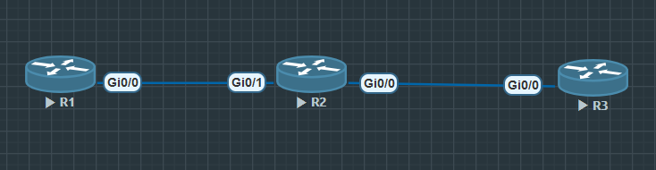

# OSPF FILTER DISTRIBUITION 



### R1
````  

interface GigabitEthernet0/0
  ip address 192.168.50.1 255.255.255.0

router ospf 24
  network 1.1.1.0 0.0.0.255 area 0
  network 192.168.50.0 0.0.0.255 area 0

````

### R2
````
interface GigabitEthernet0/1
  ip address 192.168.50.2 255.255.255.0
  no sh

interface GigabitEthernet0/0
  ip address 192.168.100.1 255.255.255.0
  no sh

router ospf 24
  network 192.168.50.0 0.0.0.255 area 0
  network 192.168.100.0 0.0.0.255 area 0
````

### R3
````
interface GigabitEthernet0/0
  ip address 192.168.100.2 255.255.255.0
  no sh

router ospf 24
  network 192.168.100.0 0.0.0.255 area 0
````